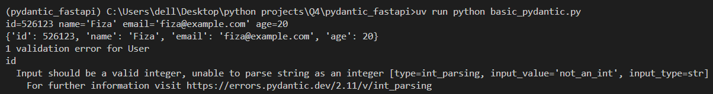
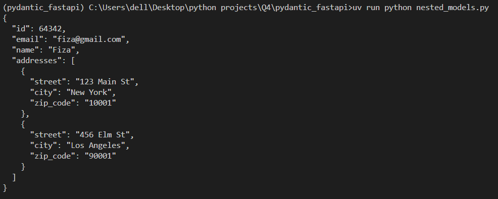
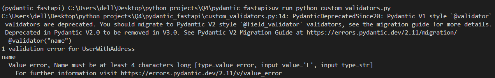

# Pydantic with FastAPI 

Pydantic ek aisa Python library hai jo data ko check karta hai (validation) aur usko organize karta hai (settings management). Ye Python ke type hints (jaise str, int, List) ka use karke ye decide karta hai ki:

 - ✔ Data sahi format mein hai ya nahi
 - ✔ Agar nahi hai, toh kya error dena hai
 - ✔ Data ko JSON ya Python objects mein easily convert karna

## Key Features

-  ✔ **Type-Safe Validation :** It checks if your data is in the correct format (e.g., "age" must be a number)
- ✔ **Automatic Conversion :** It automatically converts data types (e.g., "5" → 5 if you need an integer)
- ✔ **Error Handling :** If the data is invalid, Pydantic provides clear error messages.
- ✔ **Nested Models :** You can validate complex JSON data structures. Handles deeply nested JSON data effortlessly.
- ✔ **Serialization (JSON Conversion) :** Converts Python objects into JSON easily.Makes data ready to send to Next.js or other frontends.
- ✔ **Custom Validator :** You can make your own rules .


# Simple Pydantic Example : 
```
# 1st Step --> Import Essentials
from pydantic import BaseModel, ValidationError

# 2nd Step --> Base Model (Data Blueprint)
class User(BaseModel):
    id: int
    name: str
    email: str
    age: int | None = None 

# 3rd Step --> Process Valid Data 
user_data = {"id": 526123, "name": "Fiza", "email": "fiza@example.com", "age": 20}
user = User(**user_data) # Dictionary Unpacking
print(user) 
print(user.model_dump())  

# 4th Step --> Handle Invalid Data  
try:
    invalid_user = User(id="not_an_int", name="Maheen", email="maheen@example.com")
except ValidationError as e:
    print(e)

```
### 1st Step:
Here first we import Essentials : 
-  🧱 BaseModel: The building block for creating data models (like a blueprint)
- Ye hume validation, type conversion, aur serialization features deta hai

❗ Iske bina Pydantic ka koi use nahi!
- 🚨 ValidationError: Our safety net for catching data validation mistakes

### 2nd Step : 
- 📝 Fields Definition:
   - id, name, email → Required fields (must provide)
   - age → Optional field (defaults to None if missing)

- 🔍 Auto-Validation: Pydantic will check types automatically

### 3rd Step : 
- 📦 Dictionary Input: Raw data in dict format
- 🎁 Unpacking Magic: **user_data converts dict → Pydantic model
- ✔️ Success Outputs:
  -  print(user) → Structured model view
  -  model_dump() → Model → dict conversion

### 4th Step : 
- 💥 Force Error: Deliberately use string "not_an_int" for integer id
- 🛡️ Error Shield: try-except prevents crash
- 📢 Error Message: Pydantic clearly explains:
    - Expected type (int)
    - Received value ("not_an_int")
    - Field location (id)

### 🎯 Final Output



- ✅ Clean Success: Data converted and validated perfectly
- ❌ Clear Error: Tells exactly what went wrong and where

# Nested Pydantic Models Example
```
from pydantic import BaseModel , EmailStr 

class Address(BaseModel):
    street : str
    city : str
    zip_code : str
      
class UserWithAddress(BaseModel):
    id : int 
    email : EmailStr
    name : str
    addresses : list[Address]
      
user_data = {
    "id" : 64342 , 
    'email'  : "fiza@gmail.com",
    'name' : "Fiza", 
    'addresses' : [
        {
            'street' : "123 Main St",
            'city' : "New York",
            'zip_code' : "10001"
        },
        {
            'street' : "456 Elm St",
            'city' : "Los Angeles",
            'zip_code' : "90001"
        }
    ]
}
    
    
user = UserWithAddress.model_validate(user_data)
print(user.model_dump_json(indent= 2))
```

While the first example showed flat data validation, this demonstrates hierarchical data handling by nesting models.

**� New Import**

- EmailStr: Specialized string validation for emails (more strict than regular str)

**🌐 Address Model (Reusable Component)**

- Acts as a self-contained validation unit for address data
- Can be reused across multiple user models

**👥 Composite User Model**

- list[Address] automatically validates each dictionary in the list as an Address
- Maintains all base features from first example (type conversion, validation)

**🚀 Validation**

- .model_validate(): Alternative to dictionary unpacking (handles nested data cleanly)
- Pretty JSON Output:
  - indent=2 formats nested structures readably
  - Full validation of both outer user data AND inner address data
### 🎯 Final Output



# Custom Validators Example 

```
from pydantic import BaseModel, EmailStr, validator, ValidationError

class Address(BaseModel):
    street: str
    city: str
    zip_code: str

class UserWithAddress(BaseModel):
    id: int
    name: str
    email: EmailStr
    addresses: list[Address]

#Custom Validators
    @validator("name")
    def name_must_be_at_least_four_chars(cls, v):
        if len(v) < 4:
            raise ValueError("Name must be at least 4 characters long")
        return v

try:
    invalid_user = UserWithAddress(
        id=73846,
        name="F", 
        email="fiza@example.com",
        addresses=[{"street": "789 Pine Rd", "city": "Chicago", "zip_code": "60601"}],
    )
except ValidationError as e:
    print(e)
```

### **🔍 What's New Here?**

- Custom Validation → The @validator decorator

**Custom Validation**

The @validator decorator lets you create your own validation rules beyond Pydantic's built-in type checking.

**How It Works:**
- Targets Specific Fields: The decorator @validator("name") tells Pydantic this rule applies to the "name" field
- Receives the Value: The function gets the field value (v) about to be assigned
- Validation Logic: Checks if name has ≥2 characters
- Error Handling: Raises ValueError with helpful message if invalid
- Return Value: Returns the (possibly modified) value if valid

### 🎯 Final Output




## Chatbot Task
✅ Completed chatbot implementation  
📝 Will soon add detailed documentation including:
- Step-by-step development process
- Key learnings and insights
- Beginner-friendly explanations

*Note: This documentation is primarily for my learning process, but I hope it benefits others too.*