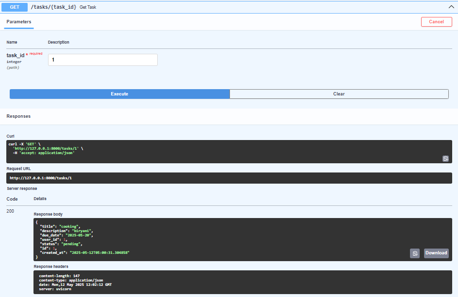

# 📝 Task Tracker API

Welcome to the Task Tracker API built using FastAPI and Pydantic.

This API allows you to create users, create tasks linked to users, update task statuses, and retrieve tasks.

# 📜 Code Overview
## 1. Models

- UserCreate:

    For creating a new user — requires user_name (3-20 characters) and email ending with .com.

- UserRead:

    For returning user data — includes user_id, user_name, and email.

- TaskCreate:

    For creating a new task — requires title, optional description, due_date, user_id, and status.

    Also validates that due_date must be today or a future date.

- TaskRead:
    
    Extends TaskCreate — adds id and created_at fields.

- StatusUpdateModel:

    Used for updating the status of an existing task.

## 2. Storage

- **USERS:**  A dictionary to store all users, with user_id as the key.

- **TASKS:** A dictionary to store all tasks, with task_id as the key.

- **ALLOWED_STATUSES:** List of allowed task statuses — pending, in_progress, completed.

## 3. Endpoints

| Method | Endpoint               | Description                 |
| :----- | :--------------------- | :--------------------------- |
| GET    | `/`                     | Welcome message              |
| POST   | `/users/`               | Create a new user            |
| GET    | `/users/{user_id}`      | Get a user by ID             |
| POST   | `/tasks/`               | Create a new task            |
| GET    | `/tasks/{task_id}`      | Get a task by ID             |
| PUT    | `/tasks/{task_id}`      | Update a task's status       |
| GET    | `/users/{user_id}/tasks` | Get all tasks linked to a user |

# 🚀 API Usage Flow (with Images)

###  Step 1: Create a User

- Go to /users/ POST endpoint in Swagger UI (/docs).

- Provide user_name and email.

- User will automatically get a new user_id.

#### user creation 

#### Response

### Step 2: Get the Created User

- Go to /users/{user_id} GET endpoint.

- Enter the same user_id.

- You will see the same user_name and email you entered earlier.

#### get user 

### Step 3: Create a Task

- Go to /tasks/ POST endpoint.

- Fill in:
   - title
   - description
   - due_date
   - user_id (link the task to the user)
   - status (e.g., pending)

- A new task_id will be assigned automatically.

#### task creation 

#### Response 

### Step 4: Get the Created Task

- Go to /tasks/{task_id} GET endpoint.

- Enter the task_id.

- See all task details you entered.

#### get task 

### Step 5: Update Task Status

- Go to /tasks/{task_id} PUT endpoint.

- Enter the task_id.

- Update the status field (e.g., change from pending to completed).

#### updating task status

### Step 6: Confirm Task Update

- Again, go to /tasks/{task_id} GET endpoint.

- You will now see the updated status (e.g., completed).

#### after updating task 

### Step 7: Get All Tasks for a User

- Go to /users/{user_id}/tasks GET endpoint.

- Enter the user_id.

- All tasks linked to that user will be shown.

#### getting user tasks

# 🎯 Conclusion

_**Using this Task Tracker API:**_

- You can manage users and assign tasks to them.

- You can update the task statuses.

- You can view tasks linked to any user easily.

_**Happy Tracking! 🚀**_